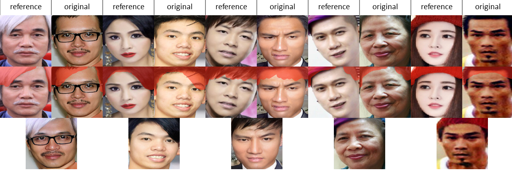

## Thesis K2018 - Image Editing
<p align="left"></p>
Forked from naver-ai/StyleMapGAN - Offical Pytorch Implementation <br>
Original paper: <br>
<i>StyleMapGAN: Exploiting Spatial Dimensions of Latent in GAN for Real-time Image Editing </i><br>
Link paper: https://arxiv.org/abs/2104.14754 <br>

## Installation

       


Clone this repository:

```bash
git clone https://github.com/nguyenquyem99dt/StyleMapGAN.git
cd StyleMapGAN/
```

Install the dependencies:
```bash
conda create -y -n stylemapgan python=3.6.12
conda activate stylemapgan
./install.sh
```

## Datasets
You can find LMDB datasets via the following link: <br>
https://drive.google.com/drive/folders/1dsaopj2l_KqO7vzlQnO-qOO0sj82VNfs?usp=sharing

## Pre-trained weights
Three pre-trained weights corresponding to VN-Celeb, CelebA-HQ and AFHQ datasets <br>
https://drive.google.com/drive/folders/1eZ2JXSVi-NpZvaBOliLWKnm4Uf_WKdIq?usp=sharing

## Demo
Upload LMDB datasets and pre-trained weights you downloaded to your google drive. <br>
Run the following notebook on Colab: <br>
https://colab.research.google.com/drive/1hFqHZZpd1tZL_Po5Z8rsR7EF4YyFYSQ4?usp=sharing

## Train network
Train network with small generator

```bash
# VN-Celeb
python train.py --dataset celeba_hq --train_data lmdb-data/vn_celeb/train --val_data lmdb-data/vn_celeb/val --small_generator

# CelebA-HQ
python train.py --dataset celeba_hq --train_data lmdb-data/celeba_hq/train --val_data lmdb-data/celeba_hq/val --small_generator

# AFHQ
python train.py --dataset afhq --train_data lmdb-data/afhq/train --val_data lmdb-data/afhq/val --small_generator

## Generate images

<b>Reconstruction</b>
Results are saved to `expr/reconstruction`.

```bash
# CelebA-HQ
python generate.py --ckpt expr/checkpoints/celeba_hq_256_8x8.pt --mixing_type reconstruction --test_lmdb data/celeba_hq/LMDB_test

# AFHQ
python generate.py --ckpt expr/checkpoints/afhq_256_8x8.pt --mixing_type reconstruction --test_lmdb data/afhq/LMDB_test

```

<b>W interpolation</b>
Results are saved to `expr/w_interpolation`.

```bash
# CelebA-HQ
python generate.py --ckpt expr/checkpoints/celeba_hq_256_8x8.pt --mixing_type w_interpolation --test_lmdb data/celeba_hq/LMDB_test

# AFHQ
python generate.py --ckpt expr/checkpoints/afhq_256_8x8.pt --mixing_type w_interpolation --test_lmdb data/afhq/LMDB_test
```

## Metrics
* Reconstruction: LPIPS, MSE
* Generation: FID
* Local editing: MSE<sub>src</sub>, MSE<sub>ref</sub>, Detectability (Refer to [CNNDetection](https://github.com/PeterWang512/CNNDetection))

If you want to see details, please follow `metrics/README.md`.<br>
Or you can run the following notebooks:<br>
# VN-Celeb
https://colab.research.google.com/drive/1VSJX35k_bGhxNSlIGb3u2d1oRh3_DfIZ?usp=sharing
# CelebA-HQ
https://colab.research.google.com/drive/1coWv9sI5lh3AS6fAYDHbAYJMaWX9fAhv?usp=sharing
# AFHQ
https://colab.research.google.com/drive/1kPu7SQ00vC5dx0W4K8_feeP81gLzlUIH?usp=sharing
## License
The source code, pre-trained models, and dataset are available under [Creative Commons BY-NC 4.0](LICENSE) license by NAVER Corporation. You can **use, copy, tranform and build upon** the material for **non-commercial purposes** as long as you give **appropriate credit** by citing our paper, and indicate if changes were made. 

For business inquiries, please contact clova-jobs@navercorp.com.<br/>	
For technical and other inquires, please contact hyunsu1125.kim@navercorp.com.

## Citation
If you find this work useful for your research, please cite our paper:
```
@inproceedings{kim2021stylemapgan,
  title={Exploiting Spatial Dimensions of Latent in GAN for Real-time Image Editing},
  author={Kim, Hyunsu and Choi, Yunjey and Kim, Junho and Yoo, Sungjoo and Uh, Youngjung},
  booktitle={Proceedings of the IEEE Conference on Computer Vision and Pattern Recognition},
  year={2021}
}
```
## Related Projects

Model code starts from [StyleGAN2 PyTorch unofficial code](https://github.com/rosinality/stylegan2-pytorch), which refers to [StyleGAN2 official code](https://github.com/NVlabs/stylegan2).
[LPIPS](https://github.com/richzhang/PerceptualSimilarity), [FID](https://github.com/mseitzer/pytorch-fid), and [CNNDetection](https://github.com/PeterWang512/CNNDetection) codes are used for evaluation.
In semantic manipulation, we used [StyleGAN pretrained network](https://github.com/NVlabs/stylegan) to get positive and negative samples by ranking.
The demo code starts from [Neural-Collage](https://github.com/quolc/neural-collage#web-based-demos).
